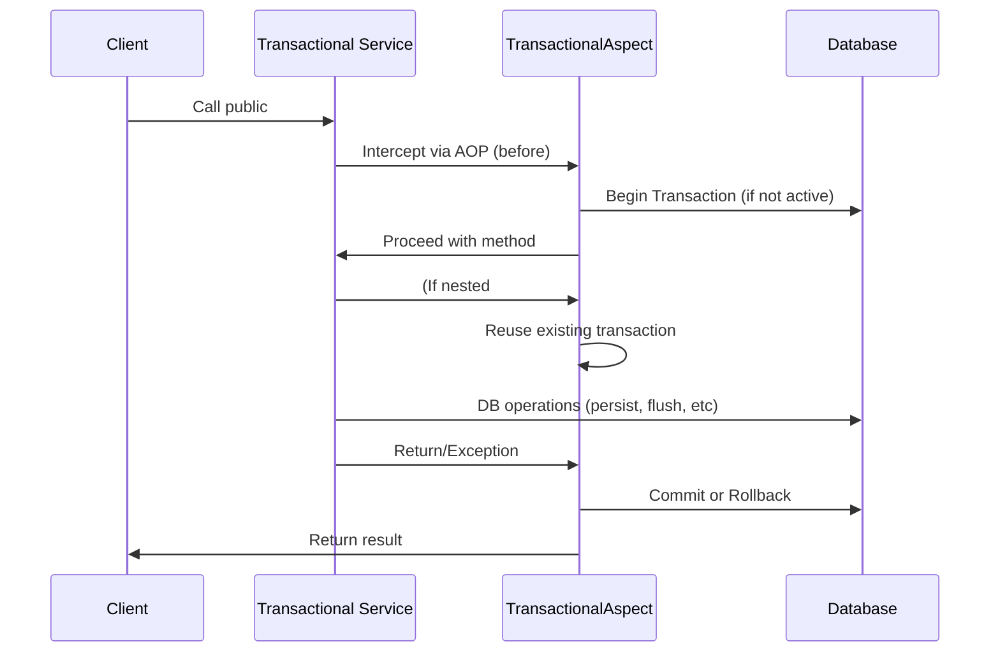

# Transaction Workflow (Mermaid)

Below is a Mermaid diagram illustrating the typical workflow of declarative transaction management and nested transaction propagation in this bundle:

## 说明

- 只有外层事务会真正开启和提交/回滚事务，内层事务自动复用外层。
- 事务的开启、提交、回滚以及异常都会自动记录日志。
- 任何异常抛出时，事务自动回滚。
